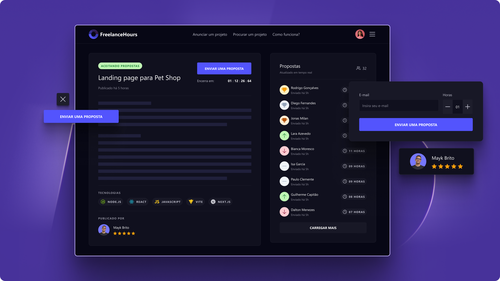

<p align="center"></a></p>

<p align="center">
  
    
</p>

## FreelanceHours Project

**FreelanceHours** is an application designed to allow freelancers contribute their hours to a project created by a client. The client can then view the rankings of the freelancers and decide who to hire for the project. It is built using PHP, Laravel and Livewire.

<br>

<p align="center">
  
</p>

### Technologies

- [**PHP**](https://www.php.net/): Programming language;
- [**Laravel**](https://laravel.com/): PHP Framework used for structuring and organizing the application;
- [**Livewire**](https://laravel-livewire.com/): Library used to create dynamic and reactive interfaces without leaving Laravel;
- [**Tailwind**](https://tailwindcss.com/): CSS framework that facilitates the development of modern and responsive interfaces. 

### Pre-requisites

- [Docker](https://www.docker.com/): Containerization platform;
- [Docker Compose](https://docs.docker.com/compose/): Tool for defining and running multi-container Docker applications.
- [Composer](https://getcomposer.org/): Dependency manager for PHP;
- [Node.js](https://nodejs.org/): JavaScript runtime environment;
- [NPM](https://www.npmjs.com/): Package manager for JavaScript.

### How to run

1. Clone the repository:
```bash
git clone https://github.com/guilhermedesousa/freelance-hours.git
```

2. Enter the project directory:
```bash
cd freelance-hours
```

3. Install the dependencies:
```bash
composer install
npm install
```

3. Create a `.env` file:
```bash
cp .env.example .env
```

4. Generate the Laravel application key:
```bash
./vendor/bin/sail artisan key:generate
```

5. Start the application:
```bash
./vendor/bin/sail up
```

6. Access the application in your browser:
```
http://localhost
```

### License

This project is under the MIT license.
